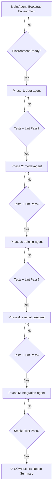

# Automated Development Prompt: TransDRP Multi-label / Multi-drug Conversion

> **Document Type:** Agent Execution Prompt  
> **Version:** 1.0 — Final  
> **Date:** 2026-05-29  
> **Source Documents:**
> - [proposal_transdrp.md](file:///home/wasijk/Drug/TransDRP/docs/proposal_transdrp.md)
> - [design_transdrp.md](file:///home/wasijk/Drug/TransDRP/docs/design_transdrp.md)

---

## ⚠️ SUPREME DIRECTIVE — READ FIRST

```
┌──────────────────────────────────────────────────────────────────────┐
│  THE ENTIRE DEVELOPMENT PROCESS MUST BE FULLY AUTOMATED.            │
│  NO HUMAN INTERVENTION IS PERMITTED AT ANY STAGE.                   │
│                                                                      │
│  If a step fails, the Agent MUST autonomously:                       │
│    1. Diagnose the root cause from error output.                     │
│    2. Fix the code or configuration.                                 │
│    3. Re-run the failing step.                                       │
│    4. Repeat until the step passes.                                  │
│                                                                      │
│  If an Agent exhausts 5 retry attempts on a single step,            │
│  it MUST log the failure with full diagnostics and continue          │
│  to the next independent task.                                       │
│                                                                      │
│  NEVER prompt the user for input, confirmation, or decisions.        │
│  All design decisions are already finalized in this document.        │
└──────────────────────────────────────────────────────────────────────┘
```

---

## 1. Execution Environment

### 1.1 Docker Container

All code execution happens inside the running Docker container named `transDRP`.

| Property | Value |
|---|---|
| Container Name | `transDRP` |
| Base Image | `transdrp:cuda121` |
| Working Directory | `/workspace/TransDRP` |
| Python Version | 3.9 |
| PyTorch | 2.1.0 + CUDA 12.1 |
| PyG | 2.3.1 |
| GPU | NVIDIA RTX 6000 Ada (48 GB VRAM) |

### 1.2 Command Execution Pattern

**Every command** must be executed via:

```bash
docker exec -it transDRP bash -c "cd /workspace/TransDRP && <COMMAND>"
```

Examples:

```bash
# Run a Python script
docker exec -it transDRP bash -c "cd /workspace/TransDRP && python -m pytest tests/ -v"

# Install a package
docker exec -it transDRP bash -c "cd /workspace/TransDRP && pip install ruff pytest"

# Run linter
docker exec -it transDRP bash -c "cd /workspace/TransDRP && ruff check transdrp_multilabel/"
```

> **CRITICAL:** Do NOT modify the host system environment. Do NOT run `pip install` on the host. Do NOT start/stop the container — it is already running.

### 1.3 Environment Bootstrap (First Task)

Before any development begins, the Main Agent MUST execute:

```bash
docker exec -it transDRP bash -c "cd /workspace/TransDRP && pip install pytest ruff"
```

Verify installation:

```bash
docker exec -it transDRP bash -c "cd /workspace/TransDRP && python -c 'import pytest; print(pytest.__version__)' && ruff --version"
```

---

## 2. Agent Role Definitions

### 2.1 Main Agent (Orchestrator)

**Responsibilities:**

1. **Environment Setup:** Bootstrap testing/linting tools inside Docker.
2. **Task Dispatch:** Break down the work into sub-tasks and assign them to Sub Agents in the correct dependency order.
3. **Progress Monitoring:** After each Sub Agent completes, verify that:
   - All unit tests pass: `pytest tests/<module>/ -v --tb=short`
   - Linter passes: `ruff check transdrp_multilabel/ --select=E,F,W`
4. **Integration Gating:** Only proceed to integration testing after ALL Sub Agents have passed their module-level checks.
5. **Final Validation:** Run the end-to-end smoke test and report results.

**Dispatch Order (Dependency-Aware):**

```
Phase 1 (Parallel):   data-agent
Phase 2 (Sequential): model-agent      (depends on contracts from Phase 1)
Phase 3 (Sequential): training-agent   (depends on Phase 1 + Phase 2)
Phase 4 (Sequential): evaluation-agent (depends on Phase 1 + Phase 2 + Phase 3)
Phase 5 (Sequential): integration-agent (depends on ALL previous phases)
```

### 2.2 Sub Agents

Each Sub Agent owns a specific module package. The Sub Agent MUST:

1. Read the existing skeleton code in its assigned module.
2. Complete, fix, or refactor the code to match the design specification.
3. Write unit tests **for every public function and class method** in its module.
4. Ensure 100% pass rate on both `pytest` and `ruff`.

| Sub Agent | Owned Package | Test Directory |
|---|---|---|
| `data-agent` | `transdrp_multilabel/data/` | `tests/test_data/` |
| `model-agent` | `transdrp_multilabel/model/` | `tests/test_model/` |
| `training-agent` | `transdrp_multilabel/training/` | `tests/test_training/` |
| `evaluation-agent` | `transdrp_multilabel/evaluation/` + `transdrp_multilabel/export/` | `tests/test_evaluation/` + `tests/test_export/` |
| `integration-agent` | Entry scripts + `transdrp_multilabel/smoke/` | `tests/test_integration/` |

---

## 3. Quality Gates — MANDATORY

### 3.1 Unit Test Requirements

```
┌──────────────────────────────────────────────────────────────────────┐
│  RULE: Every Sub Agent MUST produce unit tests for EVERY public     │
│  function and class method in its assigned module.                   │
│                                                                      │
│  "Business logic code without a corresponding test is REJECTED."    │
└──────────────────────────────────────────────────────────────────────┘
```

**Testing Framework:** `pytest`

**Test File Naming Convention:**
- Source: `transdrp_multilabel/data/omics.py`
- Test:   `tests/test_data/test_omics.py`

**Test Structure:**

```python
# tests/test_data/test_omics.py
import pytest
import numpy as np
import pandas as pd
from transdrp_multilabel.data.omics import align_omics_features

class TestAlignOmicsFeatures:
    """Tests for align_omics_features function."""

    def test_intersection_correct_genes(self):
        """Aligned features should contain only genes present in both tables."""
        src = pd.DataFrame({"gene_a": [1.0], "gene_b": [2.0], "gene_c": [3.0]})
        tgt = pd.DataFrame({"gene_b": [4.0], "gene_c": [5.0], "gene_d": [6.0]})
        src_aligned, tgt_aligned = align_omics_features(src, tgt)
        assert list(src_aligned.columns) == ["gene_b", "gene_c"]
        assert list(tgt_aligned.columns) == ["gene_b", "gene_c"]

    def test_empty_intersection_raises(self):
        """Should raise ValueError when no common genes exist."""
        src = pd.DataFrame({"gene_a": [1.0]})
        tgt = pd.DataFrame({"gene_b": [2.0]})
        with pytest.raises(ValueError, match="No common genes"):
            align_omics_features(src, tgt)
```

**Minimum Test Coverage Per Module:**

| Test Category | Description | Required |
|---|---|---|
| Happy Path | Normal input → correct output | ✅ |
| Edge Cases | Empty inputs, single-row, single-column | ✅ |
| Error Handling | Missing columns, mismatched shapes, missing SMILES | ✅ |
| Shape Assertions | Output tensor/array shapes match design contracts | ✅ |
| Dtype Assertions | Output dtypes are correct (float32, int64, etc.) | ✅ |

### 3.2 Linter Requirements

**Tool:** `ruff`

**Configuration:** Create `pyproject.toml` at project root if it does not exist:

```toml
[tool.ruff]
target-version = "py39"
line-length = 120
src = ["transdrp_multilabel", "tests"]

[tool.ruff.lint]
select = ["E", "F", "W"]
ignore = [
    "E501",   # line too long (handled by formatter)
    "E741",   # ambiguous variable name (common in scientific code)
    "F401",   # unused import (allow in __init__.py)
]

[tool.ruff.lint.per-file-ignores]
"__init__.py" = ["F401"]
```

**Pass Criteria:**

```bash
docker exec -it transDRP bash -c "cd /workspace/TransDRP && ruff check transdrp_multilabel/ tests/"
# Exit code MUST be 0
```

### 3.3 Gate Verification Command

After each Sub Agent completes, the Main Agent runs:

```bash
# 1. Lint check
docker exec -it transDRP bash -c "cd /workspace/TransDRP && ruff check transdrp_multilabel/<module>/"

# 2. Unit tests
docker exec -it transDRP bash -c "cd /workspace/TransDRP && python -m pytest tests/test_<module>/ -v --tb=short"

# Both must exit with code 0 to proceed.
```

---

## 4. Project Structure

### 4.1 Existing Codebase (DO NOT DELETE)

The following legacy files are the **original TransDRP** implementation. They provide reusable components (model classes, loss functions, utilities) that the new multi-label code wraps and adapts. **Do NOT modify or delete them:**

```
TransDRP/
  config.py              # Legacy global config (drug_feat, label_graph, etc.)
  models.py              # EncoderDecoder, GraphMLP, ConnectNetwork, AdversarialNetwork, ReverseLayerF
  myloss.py              # Adversarial_loss, InfoMax_loss
  pretraining.py         # Legacy pre-training loop
  classifier.py          # Legacy multi_training
  finetuning.py          # Legacy domain adaptation training + testing
  dataload.py            # Legacy data loading utilities
  utility.py             # set_seed_all, classification_metric, edge_extract, GraphDataset, collate
  main.py                # Legacy 9-drug entry point (reference only)
  train_params.json      # Legacy hyperparameter defaults
```

### 4.2 New Multi-label Package (Your Work Target)

```
TransDRP/
  pretrain_multilabel_hyper_main.py      # ✅ Entry point (EXISTS — verify & test)
  drug_ft_multilabel_hyper_main.py       # ✅ Entry point (EXISTS — verify & test)
  pyproject.toml                         # NEW — ruff + pytest config

  transdrp_multilabel/
    __init__.py                          # ✅ EXISTS
    config.py                            # ✅ EXISTS — CLI parsing & parameter resolution
    contracts.py                         # ✅ EXISTS — Dataclass contracts
    seed.py                              # ✅ EXISTS — Random seed control
    io.py                                # ✅ EXISTS — File read/write utilities
    validators.py                        # ✅ EXISTS — Table shape & format validators

    data/
      __init__.py                        # ✅ EXISTS
      sample_id.py                       # ✅ EXISTS — Sample ID normalization & TCGA matching
      omics.py                           # ✅ EXISTS — Gene feature intersection & alignment
      drug_index.py                      # ✅ EXISTS — Drug list union extraction
      response_matrix.py                 # ✅ EXISTS — Long to wide response + mask matrix
      split.py                           # ✅ EXISTS — Stratified KFold splits
      cancer_type.py                     # ✅ EXISTS — Cancer type mapping
      prepare_pretrain.py                # ✅ EXISTS — Pipeline for Stage 1 data preparation
      prepare_finetune.py                # ✅ EXISTS — Pipeline for Stage 2 data preparation

    model/
      __init__.py                        # ✅ EXISTS
      heads.py                           # ✅ EXISTS — Dynamic GNN multi-output head
      legacy_adapter.py                  # ✅ EXISTS — Adapt original TransDRP models
      checkpoint.py                      # ✅ EXISTS — Encoder weight save/load

    training/
      __init__.py                        # ✅ EXISTS
      losses.py                          # ✅ EXISTS — Masked BCE, MAE losses
      selection.py                       # ✅ EXISTS — Early stopping / validation checkpointing
      trainer.py                         # ✅ EXISTS — Stage 1 and Stage 2 training loops
      runners.py                         # ✅ EXISTS — Run orchestrators

    evaluation/
      __init__.py                        # ✅ EXISTS
      prediction.py                      # ✅ EXISTS — Prediction tables writer
      metrics.py                         # ✅ EXISTS — Per-drug & summary metrics calculations

    export/
      __init__.py                        # ✅ EXISTS
      latent.py                          # ✅ EXISTS — Latent vector exporter
      visualization.py                   # ✅ EXISTS — t-SNE plotter

    smoke/
      __init__.py                        # ✅ EXISTS
      smoke_runner.py                    # ✅ EXISTS — End-to-end smoke test with synthetic data

  tests/                                 # NEW — create entire directory tree
    __init__.py
    conftest.py                          # Shared fixtures (synthetic data generators, tmp dirs)
    test_data/
      __init__.py
      test_sample_id.py
      test_omics.py
      test_drug_index.py
      test_response_matrix.py
      test_split.py
      test_cancer_type.py
      test_prepare_pretrain.py
      test_prepare_finetune.py
    test_model/
      __init__.py
      test_heads.py
      test_legacy_adapter.py
      test_checkpoint.py
    test_training/
      __init__.py
      test_losses.py
      test_selection.py
      test_trainer.py
    test_evaluation/
      __init__.py
      test_prediction.py
      test_metrics.py
    test_export/
      __init__.py
      test_latent.py
      test_visualization.py
    test_integration/
      __init__.py
      test_smoke.py
      test_entry_points.py
```

---

## 5. Data Contracts Reference

All data contracts are defined in [contracts.py](file:///home/wasijk/Drug/TransDRP/transdrp_multilabel/contracts.py). Sub Agents MUST use these dataclasses as the interface between modules. **Do NOT create ad-hoc dictionaries or tuples to pass data between modules.**

### 5.1 Core Contracts Summary

| Dataclass | Key Fields | Used By |
|---|---|---|
| `TransDRPMultilabelConfig` | `task_type`, `source_omics_path`, `target_omics_path`, `device`, `alph`, `beta`, ... | All modules |
| `OmicsTable` | `x: pd.DataFrame`, `sample_ids: List[str]`, `feature_names: List[str]`, `domain` | data/, model/ |
| `DrugIndex` | `drug_ids: List[str]`, `drug_to_index`, `index_to_drug`, `n_drugs` | data/, model/, training/ |
| `ResponseMatrix` | `y: np.ndarray [N, D]`, `mask: np.ndarray [N, D]`, `sample_ids`, `label_semantics` | data/, training/ |
| `PreparedPretrainData` | `source_omics`, `target_omics`, `feature_alignment` | runners.py |
| `PreparedFineTuneData` | `source_omics`, `target_omics`, `source_response`, `target_response`, `drug_index`, `folds`, `cancer_type_table` | runners.py |
| `SourceFold` | `fold_id`, `train_sample_ids`, `val_sample_ids`, `test_sample_ids` | split.py, runners.py |
| `TrainingResult` | `fold_id`, `best_model_path`, `best_epoch`, `best_metric_name`, `best_metric_value`, `train_log` | trainer.py |
| `PredictionBundle` | `source_predictions`, `target_predictions`, `source_metrics_per_drug`, `target_metrics_per_drug`, `source_metrics_summary`, `target_metrics_summary` | evaluation/ |

### 5.2 Shape Contracts

| Variable | Shape | Dtype |
|---|---|---|
| Omics matrix `x` | `[N_samples, N_features]` | float32 |
| Response matrix `y` | `[N_samples, N_drugs]` | float32 |
| Binary mask `mask` | `[N_samples, N_drugs]` | float32 (0.0 or 1.0) |
| Drug node features `node_x` | `[N_drugs, 64]` | float32 |
| Edge index | `[2, N_edges]` | int64 |
| GNN output (per batch) | `[Batch_Size, N_drugs]` | float32 |
| Latent features | `[Batch_Size, latent_dim]` | float32 |

---

## 6. Detailed Sub Agent Task Specifications

### 6.1 `data-agent`

**Scope:** `transdrp_multilabel/data/` (8 source files) + `tests/test_data/` (8 test files)

**Approach:** Read each existing source file. Verify correctness against the design spec. Fix bugs. Write comprehensive tests.

#### Module-by-Module Instructions:

**`sample_id.py`** — Sample ID Normalization
- Contains `sample_match_key()` that normalizes TCGA barcodes (e.g., `TCGA-AA-001-01A` → `TCGA-AA-001`) for matching between omics and response tables.
- **Test:** Verify normalization for various TCGA barcode formats, non-TCGA IDs, edge cases (empty string, None).

**`omics.py`** — Gene Feature Intersection & Alignment
- Reads two omics CSVs, identifies the sample ID column, extracts numeric gene expression columns, and aligns them by gene intersection.
- **Design Rule:** The function must raise `ValueError` if the gene intersection is empty.
- **Test:** Happy path with overlapping genes, partial overlap, zero overlap (error), single-gene intersection, column ordering consistency.

**`drug_index.py`** — Drug List Union Extraction
- Reads source and target response CSVs, extracts the union of unique drug names, builds `DrugIndex` dataclass.
- Drug names are normalized to lowercase and stripped of whitespace.
- **Test:** Union from two disjoint drug sets, overlapping sets, single drug, case-insensitive deduplication.

**`response_matrix.py`** — Long-to-Wide Response Matrix
- Converts long-format response table (`Sample_ID, drug_name, Label`) into wide matrix `[N_samples, N_drugs]` + binary mask.
- Missing drug-sample pairs get `y=0.0, mask=0.0`.
- **Test:** Full coverage (all samples × all drugs present), partial coverage, single sample, regression vs. classification label types, shape assertions.

**`split.py`** — Stratified K-Fold Splits
- Generates `n_splits` stratified folds on source sample IDs.
- Each fold produces train/val/test splits. The `source_test_size` parameter controls the held-out test fraction.
- **Test:** Verify fold count, no sample leakage between train/val/test, all samples covered across folds.

**`cancer_type.py`** — Cancer Type Mapping
- Reads source and target cancer type CSVs, normalizes sample IDs, merges into a single DataFrame with columns `["sample_id", "cancer_type"]`.
- **Test:** Merging two tables, missing samples default to "Unknown", column name normalization.

**`prepare_pretrain.py`** — Stage 1 Data Pipeline
- Orchestrates: read omics → align features → return `PreparedPretrainData`.
- **Test:** With synthetic omics CSV files, verify the returned dataclass has correct shapes and aligned features.

**`prepare_finetune.py`** — Stage 2 Data Pipeline
- Orchestrates: read omics → align features → read responses → build drug index → validate SMILES coverage → build response matrices → generate folds → read cancer types → return `PreparedFineTuneData`.
- **Critical Rule:** If any drug in the union is missing from the SMILES CSV, raise `ValueError` and halt.
- **Test:** Full pipeline with synthetic data (classification + regression), missing SMILES drug (error), missing response columns (error).

#### Test Fixtures (`tests/conftest.py`):

The `data-agent` MUST create `tests/conftest.py` with shared pytest fixtures:

```python
import pytest
import os
import tempfile
import numpy as np
import pandas as pd


@pytest.fixture
def tmp_data_dir(tmp_path):
    """Create a temporary directory with synthetic CSV files for testing."""
    genes = [f"gene_{i}" for i in range(20)]

    # Source omics
    src_samples = [f"CCLE_sample_{i}" for i in range(10)]
    src_omics = pd.DataFrame(np.random.randn(10, 20), columns=genes)
    src_omics.insert(0, "Sample_ID", src_samples)
    src_omics.to_csv(tmp_path / "source_omics.csv", index=False)

    # Target omics
    tgt_samples = [f"TCGA-AA-00{i}-01A" for i in range(10)]
    tgt_omics = pd.DataFrame(np.random.randn(10, 20), columns=genes)
    tgt_omics.insert(0, "tissue_id", tgt_samples)
    tgt_omics.to_csv(tmp_path / "target_omics.csv", index=False)

    # Drug SMILES
    drugs = ["druga", "drugb", "drugc"]
    smiles_df = pd.DataFrame({
        "drug_id": drugs,
        "Isosmiles": [
            "CC1=C(C(C(=C(C1=O)C)O)O)C",
            "CN(C)C(=N)N=C(N)N",
            "CC1(C(C2C(C(O1)O)OC3C2(C(=C)C(C3=O)O)C)O)C",
        ],
    })
    smiles_df.to_csv(tmp_path / "drug_smiles.csv", index=False)

    # Source response (classification)
    src_resp_rows = []
    for sid in src_samples:
        for d in ["DrugA", "DrugB", "DrugC"]:
            src_resp_rows.append({
                "Sample_ID": sid,
                "drug_name": d,
                "Label": float(np.random.choice([0.0, 1.0])),
            })
    pd.DataFrame(src_resp_rows).to_csv(tmp_path / "source_response.csv", index=False)

    # Target response
    tgt_patient_ids = [f"TCGA-AA-00{i}" for i in range(10)]
    tgt_resp_rows = []
    for pid in tgt_patient_ids:
        for d in ["DrugA", "DrugB", "DrugC"]:
            tgt_resp_rows.append({
                "Patient_id": pid,
                "drug_name": d,
                "Label": float(np.random.choice([0.0, 1.0])),
            })
    pd.DataFrame(tgt_resp_rows).to_csv(tmp_path / "target_response.csv", index=False)

    # Cancer types
    pd.DataFrame({
        "Sample_ID": src_samples,
        "Cancer_type": ["COAD"] * 5 + ["READ"] * 5,
    }).to_csv(tmp_path / "source_cancer_types.csv", index=False)

    pd.DataFrame({
        "Patient_id": tgt_patient_ids,
        "Cancer_type": ["COAD"] * 5 + ["READ"] * 5,
    }).to_csv(tmp_path / "target_cancer_types.csv", index=False)

    return tmp_path
```

---

### 6.2 `model-agent`

**Scope:** `transdrp_multilabel/model/` (3 source files) + `tests/test_model/` (3 test files)

#### Module-by-Module Instructions:

**`heads.py`** — `MultiOutputDrugHead`
- Wraps the legacy `GraphMLP` interface to accept dynamic `N_drugs`.
- Input: `(encoder_output, node_x, edge_index)` where `encoder_output.shape = [B, latent_dim]`, `node_x.shape = [N_drugs, 64]`.
- Output: `[B, N_drugs]` prediction scores.
- **Test:**
  - Forward pass shape assertion with various `N_drugs` (3, 9, 50).
  - Gradient flow (backprop does not error).
  - Parameter count scales with `N_drugs`.

**`legacy_adapter.py`** — Build Legacy TransDRP Components
- `build_legacy_transdrp_components(config, n_features)` creates the shared encoder (`FeatMLP`), decoder, and `EncoderDecoder` wrapper from the legacy `models.py`.
- `run_pretrain(config, prepared_data, output_dir)` executes Stage 1 pre-training using legacy `pretraining.training()`.
- **Test:**
  - Component construction with various `n_features` and `latent_dim`.
  - Encoder output shape matches `latent_dim`.
  - `run_pretrain` smoke test with tiny synthetic data (2 epochs).

**`checkpoint.py`** — Save/Load Encoder Weights
- `save_checkpoint(model, path)` → `torch.save(model.state_dict(), path)`
- `load_checkpoint(model, path, device)` → `model.load_state_dict(torch.load(path, map_location=device))`
- **Test:**
  - Round-trip save → load produces identical weights.
  - Loading on CPU when saved on CUDA (map_location test).
  - Loading a mismatched architecture raises error.

---

### 6.3 `training-agent`

**Scope:** `transdrp_multilabel/training/` (4 source files) + `tests/test_training/` (3 test files)

#### Module-by-Module Instructions:

**`losses.py`** — Masked Loss Functions
- `masked_bce_with_logits(y_pred, y_true, mask)`: Computes `BCEWithLogitsLoss` only on observed entries.
  $$\text{Loss} = \frac{\sum (\text{BCE}(yp, y) \cdot M)}{\sum M}$$
- `masked_mae(y_pred, y_true, mask)`: Computes `L1Loss` only on observed entries.
  $$\text{Loss} = \frac{\sum (|yp - y| \cdot M)}{\sum M}$$
- **Edge Case:** When `mask.sum() == 0`, return `torch.tensor(0.0)` to avoid division by zero.
- **Test:**
  - Full mask (all 1s) matches standard loss.
  - Partial mask correctly excludes masked entries.
  - Zero mask returns 0.0.
  - Gradient flows through unmasked entries.
  - Shape: scalar output.

**`selection.py`** — `MetricSelector`
- Determines which validation metric to track and whether higher or lower is better.
- Classification: track `macro_auroc` (higher is better).
- Regression: track `macro_mae` (lower is better).
- `is_better(current, best, metric_name)` → bool.
- **Test:**
  - Classification: higher AUROC replaces best.
  - Regression: lower MAE replaces best.
  - First epoch (best=None) always accepted.

**`trainer.py`** — Training Loops
- `get_tissue_prototypes(encoder, omics_x, cancer_type_table, sample_ids, domain, device)` → `DataLoader` of tissue mean latent vectors.
- `train_finetune(config, encoder, classifier, train_loader, val_loader, target_loader, node_x, edge_index, prototypes, output_dir, fold_id)` → trained `AdversarialNetwork`.
- **Design Rules:**
  - Uses `itertools.cycle` to handle mismatched source/target loader lengths.
  - GRL alpha schedule: `alpha = 2 / (1 + exp(-10p)) - 1`.
  - Total loss: `α * TransferLoss + β * ContrastiveLoss + (1 - 2α) * PredLoss`.
  - Saves best model based on `MetricSelector`.
  - Saves `training_log.csv` per fold.
- **Test:**
  - `get_tissue_prototypes` returns correct DataLoader with expected prototype count.
  - `train_finetune` runs 2 epochs on tiny synthetic data without error.
  - Best model checkpoint file is created on disk.
  - Training log CSV has correct columns.

---

### 6.4 `evaluation-agent`

**Scope:** `transdrp_multilabel/evaluation/` + `transdrp_multilabel/export/` + corresponding tests

#### Evaluation Module Instructions:

**`prediction.py`** — Prediction Table Builder
- `predict_matrix(model, x_array, batch_size, device, node_x, edge_index)` → `np.ndarray [N, D]`.
- `build_prediction_long_table(scores, y_true, mask, sample_ids, drug_index, domain, split, task_type, pred_threshold, reg_bin_threshold, fold_id, seed, cancer_type_table)` → `pd.DataFrame` with columns: `sample_id, drug_name, y_true, y_pred, y_pred_binary, mask, domain, split, fold, seed, cancer_type`.
- **Test:**
  - Output shape of `predict_matrix` matches `[N, N_drugs]`.
  - Long table has all expected columns.
  - `y_pred_binary` is correct for classification (sigmoid > threshold) and regression (value < threshold).
  - Masked entries have `mask=0`.

**`metrics.py`** — Metrics Computation
- `compute_metrics_from_predictions(pred_df, task_type, domain)` → `(per_drug_df, summary_df)`.
- Classification metrics per drug: AUROC, AUPRC, F1, Accuracy.
- Regression metrics per drug: MAE, RMSE, Pearson R, Spearman ρ.
- Summary: macro, micro, and weighted averages across drugs.
- `compute_prediction_bundle(val_pred, val_true, val_mask, tgt_pred, tgt_true, tgt_mask, task_type)` → `PredictionBundle` (used during training for validation).
- **Test:**
  - Perfect predictions → AUROC = 1.0, MAE = 0.0.
  - Random predictions → metrics in valid ranges [0, 1].
  - Single-drug edge case.
  - All-masked drug returns NaN metrics.

#### Export Module Instructions:

**`latent.py`** — Latent Vector Exporter
- `extract_latent_table(model, omics_table, batch_size, device)` → `pd.DataFrame` with columns `["sample_id", "domain", "latent_0", "latent_1", ...]`.
- **Test:**
  - Output DataFrame has `N_samples` rows.
  - Latent dimension columns match model's encoder output dim.

**`visualization.py`** — t-SNE Plotter
- `run_tsne(latent_df, seed)` → DataFrame with added `tsne_0, tsne_1` columns.
- `plot_tsne_by_domain(tsne_df, save_path)` → saves PNG colored by domain.
- `plot_tsne_by_cancer_type(tsne_df, cancer_type_table, save_path)` → saves PNG colored by cancer type.
- **Test:**
  - `run_tsne` adds exactly 2 new columns.
  - PNG files are created and non-empty.
  - Edge case: single sample returns None (t-SNE needs ≥2 samples).

---

### 6.5 `integration-agent`

**Scope:** Entry scripts + Smoke Test + End-to-End validation

#### Tasks:

1. **Verify Entry Points Syntax:**
   ```bash
   docker exec -it transDRP bash -c "cd /workspace/TransDRP && python -c 'import pretrain_multilabel_hyper_main'"
   docker exec -it transDRP bash -c "cd /workspace/TransDRP && python -c 'import drug_ft_multilabel_hyper_main'"
   ```

2. **Verify CLI `--help` Works:**
   ```bash
   docker exec -it transDRP bash -c "cd /workspace/TransDRP && python pretrain_multilabel_hyper_main.py --help"
   docker exec -it transDRP bash -c "cd /workspace/TransDRP && python drug_ft_multilabel_hyper_main.py --help"
   ```

3. **Run Smoke Test (Synthetic Data, CPU):**
   ```bash
   docker exec -it transDRP bash -c "cd /workspace/TransDRP && python -m transdrp_multilabel.smoke.smoke_runner"
   ```
   - This test generates synthetic data, runs Stage 1 (2 epochs), then Stage 2 classification (2 epochs) and regression (2 epochs).
   - **Pass Criteria:** Exit code 0, no tracebacks, output directory contains expected files.

4. **Verify Output Directory Structure:**
   After smoke test, verify these files exist:
   ```
   outputs/config.json
   outputs/drug_list.csv
   outputs/data_alignment_report.csv
   outputs/drug_availability_report.csv
   outputs/feature_alignment_report.csv
   outputs/run_manifest.json
   outputs/source_split.csv
   outputs/pretrain/checkpoint.pt
   outputs/fold_0/best_model.pt
   outputs/fold_0/source_prediction_results.csv
   outputs/fold_0/target_prediction_results.csv
   outputs/fold_0/source_metrics_per_drug.csv
   outputs/fold_0/target_metrics_per_drug.csv
   outputs/fold_0/source_metrics_summary.csv
   outputs/fold_0/target_metrics_summary.csv
   outputs/fold_0/source_latent_representation.csv
   outputs/fold_0/target_latent_representation.csv
   outputs/fold_0/source_latent_representation.pkl
   outputs/fold_0/target_latent_representation.pkl
   outputs/fold_0/latent_representation.pkl
   outputs/fold_0/latent_distribution_metrics.csv
   outputs/fold_0/kmeans_cancer_type_metrics.csv
   outputs/fold_0/train_log.csv
   outputs/fold_0/tsne_domain_mixing.png
   outputs/fold_0/tsne_cancer_type.png
   outputs/source_test_metrics_summary_across_folds.csv
   outputs/source_test_metrics_summary_fold_mean_std.csv
   outputs/target_eval_metrics_summary_across_folds.csv
   outputs/target_eval_metrics_summary_fold_mean_std.csv
   outputs/eval_metrics_summary_fold_mean_std.csv
   outputs/source_test_metrics_per_drug_fold_mean_std.csv
   outputs/target_eval_metrics_per_drug_fold_mean_std.csv
   outputs/latent_metrics_summary.csv
   outputs/kmeans_cancer_type_summary.csv
   outputs/kmeans_cancer_type_fold_mean_std.csv
   outputs/cancer_type_summary.csv
   outputs/fold_summary.csv
   ```

5. **Write Integration Tests** (`tests/test_integration/`):
   - `test_smoke.py`: Calls `smoke_runner.run_smoke_test()` and asserts no exception.
   - `test_entry_points.py`: Tests that entry point modules can be imported and their `main()` functions exist.

---

## 7. Architectural Design Decisions (Finalized)

These decisions are **final and non-negotiable**. Do NOT ask for confirmation.

| ID | Decision | Implementation |
|---|---|---|
| AD-01 | Drug graph construction under regression | Binarize continuous labels with `regression_binary_threshold` (default: `Z_SCORE < 0`) **only during graph building**. Use co-occurrence overlap matrix identical to classification. |
| AD-02 | Tissue contrastive loss under regression | `InfoMax_loss` remains active during regression fine-tuning. Tissue alignment is task-label independent. |
| AD-03 | GNN batching strategy | Pack each sample's drug graph as a disjoint graph in a PyG `Batch.from_data_list()`. Use `GATConv` layers. |
| AD-04 | Target labels usage | TCGA response labels are used **only for evaluation**, never in the supervised training loss. |
| AD-05 | Missing SMILES handling | Raise `ValueError` and halt immediately if any drug in the union lacks a SMILES entry. |
| AD-06 | Early stopping metric | Classification: `macro_auroc` (higher is better). Regression: `macro_mae` (lower is better). |

---

## 8. Execution Workflow Summary



### Main Agent Final Report

Upon successful completion, the Main Agent MUST output a summary:

```
============================
 TransDRP Multi-label Build
============================
Environment: Docker transDRP (Python 3.9, PyTorch 2.1.0, CUDA 12.1)

Phase 1 — data-agent:       ✅ PASS (X tests, 0 failures)
Phase 2 — model-agent:      ✅ PASS (X tests, 0 failures)
Phase 3 — training-agent:   ✅ PASS (X tests, 0 failures)
Phase 4 — evaluation-agent: ✅ PASS (X tests, 0 failures)
Phase 5 — integration:      ✅ PASS (smoke test, entry points)

Lint:  ruff check — 0 errors
Tests: pytest — XX passed, 0 failed
Smoke: End-to-end — PASS

Output directory structure verified.
All quality gates passed. Development complete.
```

---

## 9. Error Recovery Procedures

### 9.1 Import Errors

If a module import fails (e.g., `ModuleNotFoundError`), the Agent must:
1. Check if the missing module is a legacy file → ensure `sys.path` includes `TransDRP/` root.
2. Check if it is a missing pip package → install inside Docker.
3. Check for circular imports → refactor import order.

### 9.2 CUDA Out of Memory

If OOM occurs during smoke test:
1. Reduce `batch_size` to 4.
2. If still OOM, switch to `device="cpu"` for smoke test only.
3. Log the issue and continue.

### 9.3 Test Failures

If a unit test fails:
1. Read the full traceback.
2. Identify whether it is a code bug or a test bug.
3. Fix the appropriate file.
4. Re-run ONLY the failing test: `pytest tests/test_X/test_Y.py::TestClass::test_method -v`.
5. Once fixed, re-run the full module test suite to ensure no regressions.

### 9.4 Ruff Lint Errors

If `ruff check` reports errors:
1. Run `ruff check --fix transdrp_multilabel/` to auto-fix safe issues.
2. For unsafe fixes, manually edit the code.
3. Re-run `ruff check` to verify.

---

## 10. Reference: Key Legacy API Signatures

These are the legacy functions/classes that the new multi-label code wraps. Sub Agents should understand their interfaces:

### `models.py`

```python
class FeatMLP(nn.Module):
    def __init__(self, input_dim, output_dim, hidden_dims=None, drop=0.1, act_fn=nn.SELU)
    def forward(self, inputs) -> Tensor  # [B, output_dim]

class EncoderDecoder(nn.Module):
    def __init__(self, encoder, decoder, input_dim, output_dim, hidden_dims, drop, noise_flag, norm_flag, fix_source)
    def forward(self, inputs) -> [inputs, reconstructed, latent]
    def s_encode(self, inputs) -> Tensor  # shared encoder
    def p_encode(self, inputs) -> Tensor  # private encoder

class GraphMLP(nn.Module):
    def __init__(self, input_dim, output_dim, hidden_dims, drug_num, drop=0.1, act_fn=nn.SELU)
    def forward(self, x, node_x, edge_index) -> Tensor  # [B, drug_num]

class AdversarialNetwork(nn.Module):
    def __init__(self, encoder, classifier, fix_source=True)
    def forward(self, input_data, alpha, node_x, edge_index) -> (domain_output, class_output, feature)
```

### `myloss.py`

```python
def Adversarial_loss(source_domain, target_domain, loss_fn) -> Tensor  # scalar

class InfoMax_loss(nn.Module):
    def __init__(self, latent_dim)
    def forward(self, s_feat, t_feat, s_type, t_type, prototype) -> Tensor  # scalar
```

### `pretraining.py`

```python
def training(s_dataloaders, t_dataloaders, **params) -> encoder
def get_prototype(s_dataloaders, t_dataloaders, encoder, device) -> type_prototypes
```

### `utility.py`

```python
def set_seed_all(seed: int)
def classification_metric(y_true, y_pred) -> [auc, aupr, f1, acc]
def edge_extract(label_graph) -> np.ndarray  # [2, N_edges]
class GraphDataset(Dataset)
def collate(batch)
```

---

## END OF PROMPT

> This document is the complete specification for autonomous development.  
> All design decisions are finalized. No human input is required.  
> Begin execution immediately upon reading this document.
